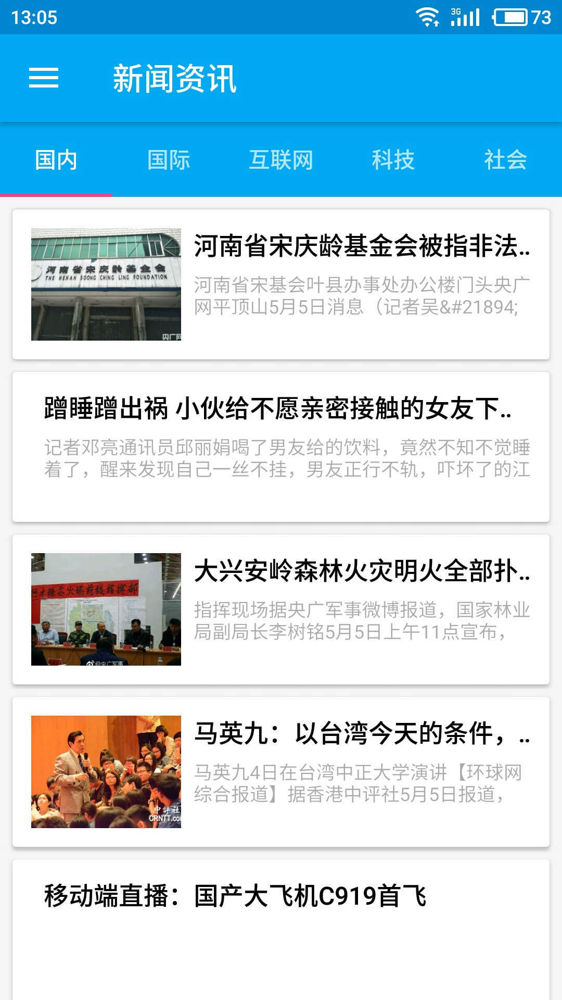
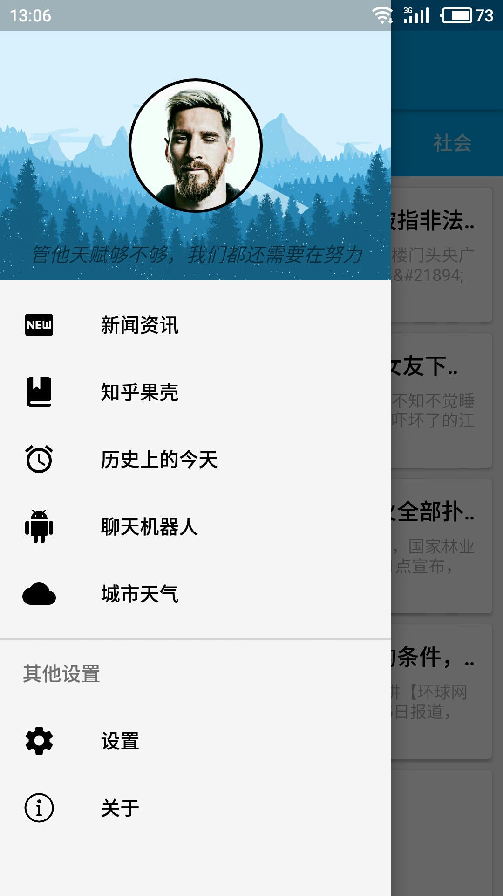
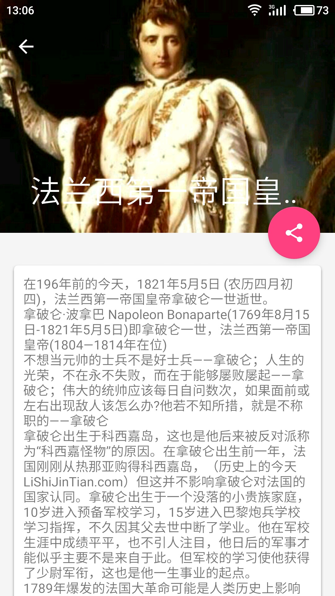

## OneReader 一读
> 一读是一款阅读类的 APP，遵循谷歌 Material Design 设计规范。项目中用到的
矢量图片均来自阿里巴巴矢量图标库

**用到的一些技术**
* Retrofit2+RxJava2+MVP
* zxing二维码扫描
* 高德地图定位

**主要功能模块**
* 新闻浏览(新闻接口已停用，没有数据了)
* 知乎豆瓣
* 历史上的今天
* 扫码查书
* 天气预报
* 图灵聊天机器人
* 主题换肤

**Android UI**

    
    
    

